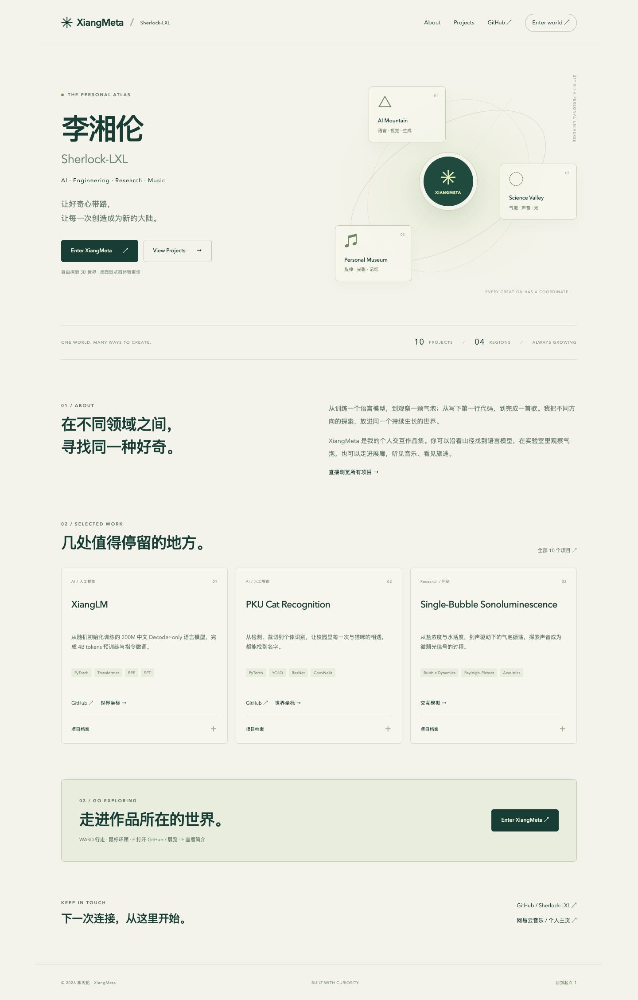
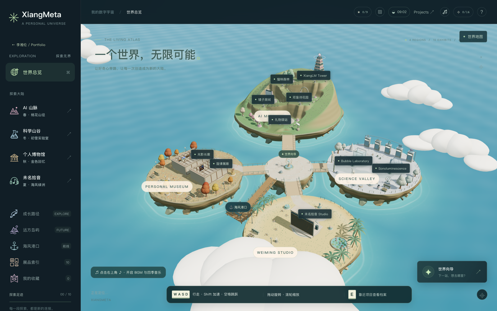

# XiangMeta

**李湘伦 / Sherlock-LXL — AI · Engineering · Research · Music**

A personal portfolio inside an explorable 3D world. This Web edition reuses
the original Three.js islands, terrain, architecture, first-person movement,
collisions, teleportation, seasons, photography and exploration systems.

`Landing → Enter XiangMeta` opens the world. `View Projects` opens the fast,
responsive project archive, with no 3D engine download.

<!-- Browser validation generates the screenshots referenced below. -->



## Local development

Node.js **22.14+** and npm are required for development. Visitors only need a
browser; there is no Python, Electron, model download or installation step.

```sh
npm ci --ignore-scripts
npm run dev
# http://127.0.0.1:5173
```

```sh
npm run build
npm test
npm run preview
# http://127.0.0.1:4173
```

Browser checks use the production files and a strict static HTTP server:

```sh
npx playwright install chromium
npm run test:ui
# Optional: install webkit and run TEST_WEBKIT=1 npm run test:ui
```

Use HTTP(S), including for a local preview. Opening `index.html` through
`file://` is not supported because the site loads ES modules and JSON.

## Controls

| Input | Action |
|---|---|
| WASD / arrows | Walk |
| Shift | Run |
| Space | Jump |
| Click canvas / drag | Look around; drag works when pointer lock is unavailable |
| F | Open nearby project's GitHub, or its exhibition when no repository is linked; inspect artwork or harbor routes |
| E | Project description, technologies, results and exhibition |
| R | Demo / music / MV, shown only when a destination exists |
| G | Discoveries and memory fragments |
| P | Photo mode; WASD moves, Q / E changes altitude |
| Esc | Close panel / release pointer |
| Sidebar region | Teleport |
| World overview | Orbit map |
| ♪ sound button | Start / pause background music, seasonal cues and chimes |

On touch devices the 3D entrance recommends the ordinary Portfolio. An
explicit “still load 3D” option remains available; touch walking is not a V1
feature. The Help panel offers reduced rendering quality.

## Content and architecture

```text
index.html                   Landing
projects/index.html          Filterable Portfolio
world/index.html             Deferred 3D entrance
data/profile.json            Name, introduction, GitHub and music profile
data/world.json              Original islands and world layout
data/audio.json              Seven BGM tracks, four seasonal cues, playback gain
data/image-previews.json     Real artwork preview → detail mapping
modules/<id>/manifest.json   Single authoring source for project + world data
modules/<id>/scene.ts        Optional original procedural scene extension
modules/<id>/assets/         Author-supplied images; local media archive
shared/                     Schemas, physics, navigation and collision rules
src/portfolio-page.ts        Lightweight ordinary pages
src/main.ts                 World interface and project actions
src/core/nearby-actions.ts   Shared key/label definitions for signs, HUD and input
src/world/                  Original world implementation
scripts/web-content.mjs      Validated static content + asset allowlist
.github/workflows/pages.yml  Build, test and deploy on main
```

The build generates `content/projects.json` and `content/world.json` from the
same manifests. Do **not** edit the generated JSON. The export strips Python
runtime settings, model forms, album audio sources and private configuration.
Only the compressed background/seasonal tracks in `data/audio.json` are exported.

Add an exhibit with a manifest using an existing visual preset, then give it
a `portfolio` section:

```json
{
  "name": "My Project",
  "category": "AI",
  "summary": "A short, factual description.",
  "technologies": ["Python", "PyTorch"],
  "github": "https://github.com/your-name/your-project",
  "order": 11,
  "featured": false
}
```

Supported categories: `AI`, `Research`, `Engineering`, `Creative`. `github`,
`demo`, `screenshots` are optional; absent links are hidden. Region-local
`position`, `visual`, `rotation`, `facts` and `story` stay in the same manifest.
Existing module schemas and optional `scene.ts` provide the full contract.
A new valid manifest automatically appears in both experiences; no registry
edit is required. Projects without verified source URLs remain browsable
without an invented GitHub link.
Physical consoles, nearby cards and the bottom action button share the same
F/E/R definitions. F always performs the displayed primary action; E opens
project details, and R appears only when a Demo/music/MV destination exists.

## Web scope and performance

- Five AI project archives link to their source repositories. Local Python
  inference remains in the historical source, not the public website.
- Both bubble research simulations still run in a browser Worker. Parameters
  illustrate the equations; they are not fitted experimental predictions.
- Albums use the author's supplied NetEase links; the MV links to Bilibili.
  The original seven BGM tracks and four seasonal cues are retained as MP3.
  They download only after clicking ♪, with crossfades, pause/resume and a
  shuffled BGM playlist. Each seasonal cue premieres once per tab journey.
- The 11 background tracks use LAME VBR q2, 44.1 kHz stereo: **83.05 MB →
  46.21 MB** (44% smaller). Playback gain balances loudness without changing
  the recordings' dynamics. Original masters remain in the local archive.
  Optional chime/interface sounds remain synthesized.
- Home and Projects do not import Three.js. World loading has a program
  download indicator, followed by measured construction-stage progress.
- All core collision geometry and **20 real artwork previews (384 KB total)**
  are ready before the loading screen closes. Region arrival upgrades the
  same textures; map/photo mode upgrades all. Full photography originals
  still load only when explicitly opened.
- Static batching, instancing, capped pixel ratio, shadow update throttling
  and the original procedural architecture are preserved. The revised world
  adds sculpted rock strata, coastal reflections/foam, warm architectural
  details and stronger directional lighting. Default DPR is capped at 1.5;
  2048px shadows update three times per second. Reduced quality remains available.
- WebGL failure offers a direct Portfolio link. Refreshing `/projects/` and
  `/world/` works with real directory index files; no SPA rewrite is needed.

There are no original GLB models to compress in this version. Draco/Meshopt,
KTX2 and additional geometry LOD remain options if future imported assets
justify them. See [migration notes](docs/web-migration.md) for measured build
sizes and validation limits.

## GitHub Pages

Target user site: **`https://Sherlock-LXL.github.io/`**.

1. Create the public repository `Sherlock-LXL.github.io`.
2. Use `npm run export:pages` to prepare a clean source folder at
   `.runtime/pages-source/`. It includes the compressed BGM/seasonal MP3s,
   excludes original audio/video archives, local model configuration,
   historical binaries and existing Git history.
3. Push that source folder to the new repository's `main` branch.
4. Set **Settings → Pages → Build and deployment → Source: GitHub Actions**.
5. The included workflow builds, runs regression/browser checks, uploads
   only `dist/`, and deploys after success.

Create the repository empty (without an initial README), then run from the
original checkout:

```sh
cd .runtime/pages-source
git init -b main
git add .
git commit -m "Launch XiangMeta Web portfolio"
git remote add origin https://github.com/Sherlock-LXL/Sherlock-LXL.github.io.git
git push -u origin main
```

When using the exported source ZIP, start in its extracted folder instead.
Use your normal GitHub authentication for the push. In the repository's
Actions tab, confirm the deployment succeeds before sharing the public URL.
If Pages was enabled only after the first push, rerun the workflow.

The local source export does not push or publish anything. Existing `origin`
is left unchanged. An authenticated GitHub account with repository permissions
is required to create/push the new repository.

The workflow obtains the correct `BASE_PATH` from `configure-pages`, so it
also supports a project site such as `/xiangmeta/`. To test locally:

```sh
BASE_PATH=/xiangmeta/ npm run build
BASE_PATH=/xiangmeta/ npm run test:ui
```

PowerShell: set `$env:BASE_PATH="/xiangmeta/"` before those commands.

## Credits

Original world and personal works: 李湘伦. 《燕来有声》 retains 未名拾音
team attribution. The author confirmed ownership/rights for the supplied media.
See [CREDITS.md](CREDITS.md) and [LICENSE](LICENSE); the MIT code license does
not relicense the photography, covers, music, lyrics, films or branding.
Three.js dependency notices are included in the built site.

In the original XiangMeta checkout, desktop history is retained under
`backend/`, `desktop/`, `docs/releases/` and the legacy scripts.
Its `npm run test:legacy` includes historical tests requiring local
Python/model/media environments; it is not the Web release gate. The clean
Pages source export excludes those archives and legacy commands.
